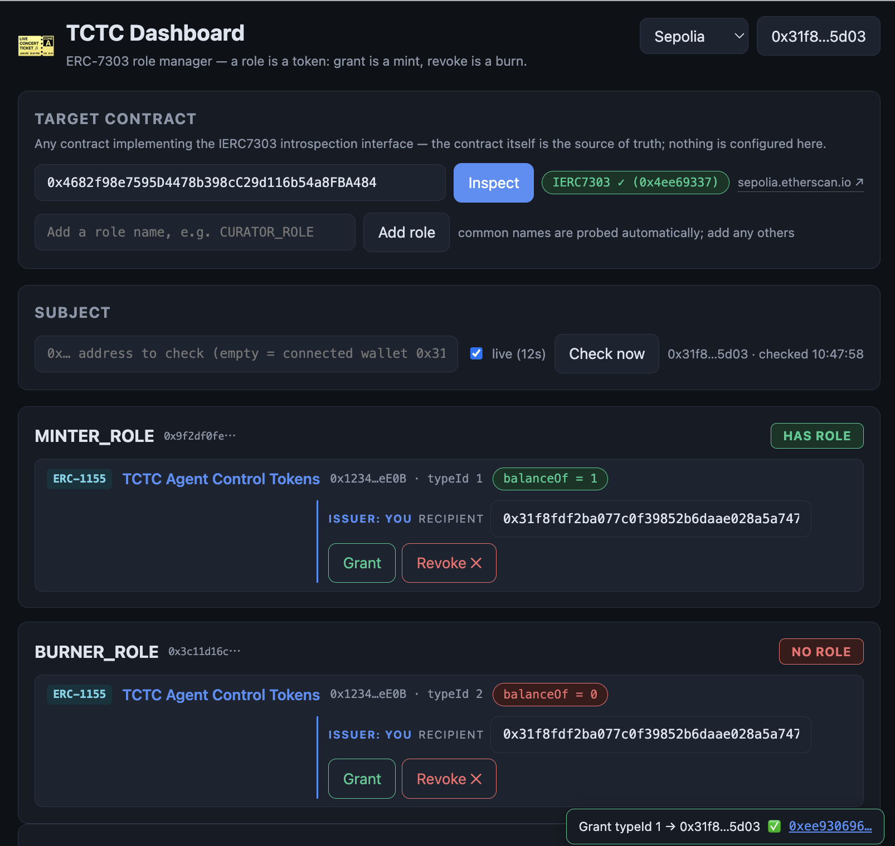

# tctc-mcp

[](https://www.npmjs.com/package/tctc-mcp)

An MCP server exposing [ERC-7303](https://eips.ethereum.org/EIPS/eip-7303)
(Token-Controlled Token Circulation) roles to AI agents: agents check
their own on-chain permissions, and human principals grant/revoke them
by minting/burning control tokens — no permission server required.

Status: **v0.3** — adds timed roles with gasless auto-expiry (below),
on top of v0.2's IERC7303 auto-discovery; published on npm
([`tctc-mcp`](https://www.npmjs.com/package/tctc-mcp)), unit-tested
and verified end-to-end against the Sepolia demo deployment (grant →
check → revoke → check, and grant-for-75s → auto-expiry, through a
real MCP client).

## Demo (60 seconds)

[](https://www.youtube.com/watch?v=o547bwYT32A)

*A human grants an AI agent a minting permission; the agent verifies it
on-chain and mints an NFT. The human burns the role token — and the
agent instantly loses the capability. Live on Sepolia, no permission
server involved.*

## Quick start

The package is published on npm, so no clone or build is needed — `npx`
fetches and runs it directly:

```bash
# 1. Get a config. The secret-free Sepolia demo config needs no API keys:
curl -fsSLO https://raw.githubusercontent.com/kofujimura/tctc-mcp/main/examples/config.sepolia.agent.json

# 2. Register with your MCP client, e.g. Claude Code
#    (read-only mode: only query tools are registered)
claude mcp add tctc -- npx -y tctc-mcp --config "$PWD/config.sepolia.agent.json"

# Admin mode (principal side): grant_role / revoke_role also registered.
# Provide the issuer key ONLY via the environment:
claude mcp add tctc-admin --env TCTC_ADMIN_PRIVATE_KEY=0x... \
  -- npx -y tctc-mcp --config "$PWD/config.sepolia.json"
```

Or in a project-scoped `.mcp.json`:

```json
{ "mcpServers": { "tctc": { "command": "npx",
    "args": ["-y", "tctc-mcp", "--config", "examples/config.sepolia.agent.json"] } } }
```

A fuller registration example is in
[examples/claude.mcp.json](examples/claude.mcp.json). The admin private
key is only ever read from the `TCTC_ADMIN_PRIVATE_KEY` environment
variable; configs containing anything that looks like a private key are
rejected at startup.

### Using tctc-mcp from your own app

The **only supported entry point is the `tctc-mcp` bin** — spawn it via
`npx --no-install tctc-mcp` (or `node_modules/.bin/tctc-mcp`). Never
reference the package's `dist/` files directly: they are internal,
their layout is unversioned, and the package's `exports` field refuses
deep imports. A minimal MCP-SDK client example (the pattern for a web
backend) is in
[examples/client-stdio.mjs](examples/client-stdio.mjs); the release
pipeline verifies the packed bin end-to-end
([scripts/verify-pack.mjs](scripts/verify-pack.mjs)).

## Web application starter

Want to see `tctc-mcp` protecting a real API route?

[`tctc-openai-starter`](https://github.com/kofujimura/tctc-openai-starter)
is a standalone Next.js starter that verifies wallet ownership with
Sign-In with Ethereum, checks the configured role through `tctc-mcp`,
and calls OpenAI only when the on-chain gate grants access.

Use it as a [GitHub template](https://github.com/new?template_name=tctc-openai-starter&template_owner=kofujimura).

## Tools

| Tool | Mode | Purpose |
|---|---|---|
| `list_roles` | both | Configured roles and their control tokens |
| `check_role` | both | Does an account hold a role? (live `balanceOf`, with evidence) |
| `check_all_roles` | both | Session-start self-assessment across all roles |
| `discover_roles` | both | Introspect **any** contract via `IERC7303` — no role config needed |
| `resolve_agent` | both* | ERC-8004 `agentId` → owner / agentURI / agentWallet / ERC-6551 TBA |
| `grant_role` | admin | Mint the control token to a subject |
| `revoke_role` | admin | Burn the subject's control token — the kill switch |

\* registered only when the config has an `identity` section.

Subjects can be given as a raw `address`, as an ERC-8004 `agentId`
(resolved to its ERC-6551 Token Bound Account, the recommended binding
target), or omitted to use the config's `self`.

## IERC7303 auto-discovery (v0.2)

ERC-7303 now defines an introspection interface
([ethereum/ERCs#1872](https://github.com/ethereum/ERCs/pull/1872), merged
2026-07-11): compliant contracts expose `hasRole`, control-token getters,
configuration events, and ERC-165 detection (interfaceId `0x4ee69337`).
tctc-mcp uses it two ways:

- **`target` roles** — a role config names only the target contract;
  the server reads which control tokens gate the role *from the contract
  itself*, and the verdict is the target's own `hasRole()` answer:

  ```json
  "roles": { "MINTER_ROLE": {
      "target": { "address": "0x4C0a78803D47154B9C6F42EC4AEbab2D1C94c97D" } } }
  ```

- **`discover_roles`** — introspect any address at run time, with no
  role configuration at all. Non-compliant contracts report
  `supportsIERC7303: false`; static `controlTokens` configs remain the
  fallback for pre-IERC7303 deployments.

Working example: [examples/config.sepolia.discovery.json](examples/config.sepolia.discovery.json)
(secret-free, public RPC), verified live by `scripts/e2e-discovery.mjs`.

## Timed roles: gasless auto-expiry (v0.3)

Delegation to an agent is usually *short-term* — "mint for one hour",
"act for the duration of this task". With an **expiring control token**
([`ExpiringControlTokens`](https://sepolia.etherscan.io/address/0xb5abB6c060ed287e8B25aD121c8B46eE404fF09b#code)),
`balanceOf()` returns 0 once the holder's expiry passes, so the role
revokes **by itself, with no transaction** — even if the principal
forgets, goes offline, or loses keys. The ERC-7303 target contract
needs no changes at all (the Sepolia expiry demo target is a
byte-for-byte copy of `TCTCDemoToken`).

- **Granting:** a role whose grant template has `$expiresAt` requires
  an expiry — `grant_role` with `expiresInSeconds: 3600` is
  "grant MINTER_ROLE for one hour":

  ```json
  "admin": { "grant": { "function": "mint(address,uint256,uint64)",
                        "args": ["$subject", "$typeId", "$expiresAt"] } }
  ```

- **Checking:** `check_role` evidence reports `expiresAt` (unix
  seconds) when the control token exposes it, so an agent can
  self-report "this permission expires in 5 minutes".
- **Kill switch unchanged:** expiry is a fail-safe, not a replacement —
  `revoke_role` (issuer burn) still revokes immediately within the
  validity window.

Working example: the `TIMED_MINTER_ROLE` in
[examples/config.sepolia.json](examples/config.sepolia.json), verified
live by `scripts/e2e-expiry.mjs` (grant for 75 s → watch it expire with
no further transaction).

## Human dashboard

**Live: <https://tctc-mcp.vercel.app/>** — while tctc-mcp exposes ERC-7303
roles to AI agents, the [TCTC Dashboard](dashboard/) exposes the same
on-chain state to the humans who manage them: inspect any IERC7303 target,
watch `hasRole` verdicts and per-control-token `balanceOf` evidence live,
grant/revoke as the issuer (with timed grants and countdowns for expiring
control tokens), and deploy new control-token collections straight from a
browser wallet. Two clients of one source of truth: the chain. See
[dashboard/README.md](dashboard/README.md) for details and try-it links.

[](https://tctc-mcp.vercel.app/)

*Not just for AI-agent delegation: any ERC-7303 contract works, so the
dashboard doubles as a general-purpose on-chain permission manager —
issue certificate collections, grant and revoke roles, and audit who
holds what, all from a browser wallet.*

## Documents

- [docs/CONCEPT.md](docs/CONCEPT.md) — background and rationale: TCTC as
  the authorization layer for AI agents, its relationship to ERC-8004
  (Trustless Agents) and ERC-6551 (Token Bound Accounts), recommended
  ERC-7303 spec updates, and the adoption strategy.
- [docs/MCP_SERVER_SPEC.md](docs/MCP_SERVER_SPEC.md) — v1 design
  specification (architecture, config, tools, security, roadmap).
- [docs/ERC_DRAFT_EXPIRABLE_1155.md](docs/ERC_DRAFT_EXPIRABLE_1155.md) —
  working draft of a planned ERC, "Expirable ERC-1155 Tokens": the
  standard behind the timed roles above (per-holder expiry, time-aware
  `balanceOf`, `expiresAt`/`ExpiryUpdated`, interface ID `0x300e616b`).
  Not yet submitted to ethereum/ERCs; feedback welcome.
- [docs/TEST_REPORT.md](docs/TEST_REPORT.md) — v1 test report: 24 unit
  tests and the live Sepolia E2E (on-chain kill-switch cycle through a
  real MCP client).
- [examples/config.sepolia.json](examples/config.sepolia.json) —
  concrete config for the Sepolia demo deployment (primary roles,
  static bindings) and the TCTC repo's `MyComplexToken` sample
  (`COMPLEX_*` roles, resolved via IERC7303 `target` discovery).
- [examples/config.sepolia.agent.json](examples/config.sepolia.agent.json)
  — secret-free agent-side config for the same demo deployment (public
  RPC, no API keys); the one used in the Quick start above.
- [examples/config.sepolia.discovery.json](examples/config.sepolia.discovery.json)
  — IERC7303 auto-discovery variant: no control tokens configured, the
  target contract explains its own role structure.
- [examples/contracts/](examples/contracts/) — sources of the demo
  contracts deployed on Sepolia (`AgentControlTokens`,
  `TCTCDemoToken`, `ERC7303`, `IERC7303`).

## Demo deployment (Sepolia, Etherscan-verified)

- `AgentControlTokens` (soulbound, issuer-burnable ERC-1155):
  [`0x12342A7F0190B3AF3F4b47546D34006EDA54eE0B`](https://sepolia.etherscan.io/address/0x12342A7F0190B3AF3F4b47546D34006EDA54eE0B#code)
- `TCTCDemoToken` (ERC-721 + ERC-7303 target, implements the
  [`IERC7303` introspection interface](https://github.com/ethereum/ERCs/pull/1872)
  — `hasRole`, control-token getters, ERC-165 detectable via interfaceId
  `0x4ee69337`):
  [`0x4C0a78803D47154B9C6F42EC4AEbab2D1C94c97D`](https://sepolia.etherscan.io/address/0x4C0a78803D47154B9C6F42EC4AEbab2D1C94c97D#code)
- `ExpiringControlTokens` (soulbound, issuer-burnable ERC-1155 with
  per-holder expiry; time-aware `balanceOf` — the basis of timed roles):
  [`0xb5abB6c060ed287e8B25aD121c8B46eE404fF09b`](https://sepolia.etherscan.io/address/0xb5abB6c060ed287e8B25aD121c8B46eE404fF09b#code)
- Expiry demo target (unmodified `TCTCDemoToken` bytecode bound to the
  expiring control tokens):
  [`0x3eAb11DE9655817A2e2977A486d9D33eBD10c9Ce`](https://sepolia.etherscan.io/address/0x3eAb11DE9655817A2e2977A486d9D33eBD10c9Ce#code)

## Development

```bash
git clone https://github.com/kofujimura/tctc-mcp.git && cd tctc-mcp
npm install && npm run build
node dist/index.js --config examples/config.sepolia.agent.json

npm test                  # unit tests (vitest)
node scripts/e2e-live.mjs # live E2E: spawns the server via MCP stdio client
                          # (needs ALCHEMY_API_KEY; admin phase additionally
                          #  TCTC_ADMIN_PRIVATE_KEY and E2E_SUBJECT)
```

## Related

- Human dashboard (this repo, [`dashboard/`](dashboard/)):
  <https://tctc-mcp.vercel.app/>
- npm package: <https://www.npmjs.com/package/tctc-mcp>
- [`tctc-openai-starter`](https://github.com/kofujimura/tctc-openai-starter)
  — Next.js starter for token-gated OpenAI access.
- Agent skill (teaches agents to use TCTC safely; install with
  `npx skills add kofujimura/tctc-skills`):
  <https://github.com/kofujimura/tctc-skills>
- TCTC reference implementation: <https://github.com/kofujimura/TCTC>
